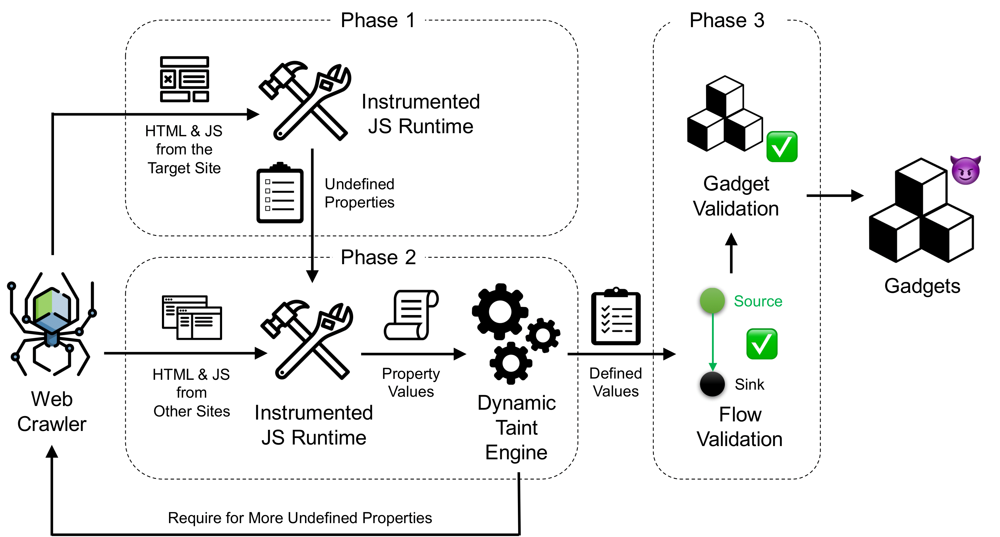

# Follow My Flow: Unveiling Client-Side Prototype Pollution Gadgets from One Million Real-World Websites

In this paper, we design a dynamic analysis framework, called GaLA (<u>Ga</u>dget <u>L</u>ocator and <u>A</u>nalyzer)
, to automatically detect client-side prototype pollution gadgets among real-world websites, and implement an open-source version of GaLA. Our key insight is to borrow existing defined values on non-vulnerable websites to victim ones where such values are undefined, thus guiding the property injection to flow to the sinks in gadgets. 

Our paper has been accepted by [IEEE Security & Privacy 2025](https://sp2025.ieee-security.org/accepted-papers.html) and is accessible via [this link](https://www.yinzhicao.org/ProbetheProto/FollowMyFlow.pdf). 

## System Design Overview

    

System Architecture of GALA. There are three major phases: (i) Locating undefined properties, (ii) Assigning defined values, and (iii) Guiding dataflows for originally undefined properties. In Phase 1, GALA runs an instrumented JS runtime to output all the undefined properties; in Phase 2, GALA finds corresponding defined values in other executions (which could exist in the same or a different website) and assigns such values to undefined ones in Phase 1; in Phase 3, GALA uses these defined values to guide the execution with previously undefined values to reach the sink and discover gadgets. All the gadgets are validated automatically using a generated payload to ensure corresponding consequences are achieved.

## Artifacts Overview

The artifacts in this repo comprise two main components: the adapted taint engine based on Chromium V8, and Python codes to analyze the log files generated by the modified engine. 

### Adapted Taint Engine

The source codes are under `./sanchecker/src`, adapted from prior taint engines [Melicher et al.](https://github.com/wrmelicher/ChromiumTaintTracking) and [ProbetheProto](https://github.com/zifeng-kang/ProbetheProto). 

*Detailed instructions coming soon!*

### Log Analysis

The `analysis` directory contains various files, but not all are necessary for the main pipeline—some are used only for debugging or statistics. Below are instructions for using the relevant scripts for each phase of GaLA.

#### Phase 1: Locating Undefined Properties

**Prerequisites:**

1. Run the Adapted Taint Engine for Phase 1 to generate site logs with undefined property information.
2. Set up a local MongoDB server.

**Steps:**

1. Modify the `base_dirs` variable in `analysis/phase1/save_log_to_db_offline.py` to point to the directory containing Phase 1 logs generated by the Adapted Taint Engine.
2. Run `save_log_to_db_offline.py` to save Phase 1 information into the MongoDB database.

#### Phase 2: Assigning Defined Values

**Prerequisites:**

1. Run the Adapted Taint Engine for Phase 2 to generate site logs and a record of defined values corresponding to undefined properties (which may be from the same or a different website).
2. Ensure your MongoDB server is running.

**Steps:**

1. Update `PHASE2_RECORD_PATH` and `PHASE2_LOG_PATH` in `analysis/phase2/config.py` to reflect the locations of the Phase 2 logs and records.
2. Run `analysis/phase2/gen_phase2_db.py` to match dataflows in the logs with the records and identify flows reaching the sink. Both matched and unmatched flows will be stored in the database.
3. Update the `csv_file_path` in `analysis/phase2/strict_match/strict_match.py` to point to the file containing the list of all site names.
4. Run `strict_match.py` to assign defined values from Phase 2 to the undefined properties from Phase 1. The property-value pairs will be stored in the database for use in Phase 3 by the Adapted Taint Engine.

#### Phase 3: Validating Flows and Exploit Generation

**Part 1: Flow Validation and Exploit Generation**

**Prerequisites:**  
Use the defined property-value pairs to guide execution with previously undefined values.

**Steps:**
1. Modify the necessary file paths in `analysis/phase3/phase3_config.py`.
2. Add your OpenAI API key to `analysis/phase3/exploit_gen/llm_config.py`.
3. Run `analysis/phase3/count_gadgets_phase3_db.py` to generate exploits for validated flows.

**Part 2: Gadget Validation**

**Prerequisite:**  
Inject the generated exploits into the targeted sites.

**Steps:**
1. Run `analysis/phase3/check_def_flows.py` to verify if the exploits successfully reach the sink.
